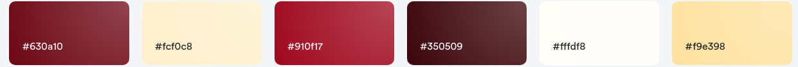

# Railroad21

_Railroad21_ is a railroad game. As a PWA it can be attached to mobile's homescreens or run in the browser.

## Status

| Status Type     | Description                                                                                            |
| :-------------- | :----------------------------------------------------------------------------------------------------- |
| Current Version | 1.1.0                                                                                                  |
| Status          | Stable version. Game playable with scoring, 15 game levels, 2 game modes, multiple layouts and trains. |

#### Quick Links

- [Build Setup](#build-setup)
- [Rules of the Game](#rules-of-the-game)
- [Architecture and Software Stack](#architecture-and-software-stack)
- [Roadmap](#roadmap)
- [Resources](#resources)
  - [Logo Design](#logo-design)
  - [Color Palette](#color-palette)
- [License](#license)

## Build Setup

```bash
# install dependencies
$ yarn install

# serve with hot reload at localhost:3000
$ yarn dev

# build for production and launch server
$ yarn build
$ yarn start

# generate static project
$ yarn generate
```

## Rules of the Game

### Level 1

- Starting with 2 trains and layout 1.
- When 500 points are reached, forward to level 2.
- Speed range: 40 - 80 km/h.

### Level 2

- Starting with 2 trains and layout 2.
- When 500 points are reached, forward to Level 3.
- Speed range: 40 - 80 km/h.

### Level 3

- Starting with 2 trains and layout 3.
- When 500 points are reached, forward to Level 4.
- Speed range: 50 - 90 km/h.

### Level 4

- Starting with 2 trains and layout 4.
- When 500 points are reached, forward to Level 5.
- Speed range: 50 - 90 km/h.

### Level 5

- Starting with 2 trains and layout 5.
- When 500 points are reached, forward to Level 6.
- Speed range: 60 - 100 km/h.

### Level 6

- Starting with 2 trains and layout 6.
- When 500 points are reached, forward to Level 7.
- Speed range: 60 - 100 km/h.

### Level 7

- Starting with 2 trains and layout 7.
- When 500 points are reached, forward to Level 8.
- Speed range: 70 - 110 km/h.

### Level 8

- Starting with 3 trains and Layout 9.
- When 500 points are reached, forward to Level 9.
- Speed range: 40 - 80 km/h.

### Level 9

- Starting with 3 trains and Layout 10.
- When 500 points are reached, forward to Level 10.
- Speed range: 50 - 90 km/h.

### Level 10

- Starting with 3 trains and Layout 11.
- When 500 points are reached, forward to Level 11.
- Speed range: 60 - 100 km/h.

### Level 11

- Starting with 3 trains and Layout 12.
- When 500 points are reached, forward to Level 12.
- Speed range: 70 - 110 km/h.

### Level 12

- Starting with 3 trains and Layout 13.
- When 500 points are reached, forward to Level 13.
- Speed range: 70 - 110 km/h.

### Level 13

- Starting with 3 trains and Layout 14.
- When 500 points are reached, forward to Level 14.
- Speed range: 80 - 120 km/h.

### Level 14

- Starting with 3 trains and Layout 15.
- When 500 points are reached, forward to Level 15.
- Speed range: 80 - 120 km/h.

### Level 15

- Starting with 4 trains and Layout 2.
- When 500 points are reached, level 15 is mastered. There are no further levels at the moment.
- Speed range: 50 - 90 km/h.

## Architecture and Software Stack

_Railroad21_ is built with [Nuxt](https://nuxtjs.org/) and [Vuetify](https://vuetifyjs.com/en/). It's built so that it can be statically served from any web server.

## Roadmap

_**Note**: This roadmap is subject to change. Functionalities may be added, removed, changed or reprioritized. Also functionalities may be moved between releases._

### Release 1.0

- Game basics.
- Simple images and graphics to represent locomotive, tracks and switches.
- Multiple trains (locomotive).
- The game will provide simple, standard layouts (only a few).
- No scoring, no game levels.
- Control through track switches and power on/off to track segments.
- Track segments with power are black. Track segments with powered turned off are grey.

### Release 1.1

- Add game mode. Game mode is one of 'play' or 'trial'. 'play' is normal game mode. In game mode 'trial', layout and number of trains can freely be chosen.
- Add scoring. The faster the speed of a train the more points per segment travelled are earned. No points are earned whenever there is a power interruption somewhere.
- Power in a segment can be interrupted by clicking the tracks in a segment. A train in that segment or travelling into that segment will be stopping.
- Add game levels, more layouts, more complex layouts.

### Release 1.2

- Attach wagons to locomotive (train composition).
- Introduce control through power switches. Definition of track segments. Power in segments may be controlled by power switches.
- Color of trackes changes according to power is on or off.

### Release 1.3

- Add sound and motion (vibrations) to enhance UX.

### Release 1.4

- Allow the user to edit train compositions. Select from various locomotives (with different speeds) and wagons (different types, lengths etc.).

### Release 2.0

- Introduce track layout build system (Lego-like) so that the player may define and use his own layouts.

### Release 2.1

- Layout Export/Import to/from files so that players may trade layouts.

### Release 3.0

- Introduce vehicle traffic and railroad crossings.

## Resources

### Logo Design

_Railroad21_'s logos were defined with [Inkscape 1.0.1](https://inkscape.org/). Many thanks go out to the authors of such wonderful FOSS.

The font used for the `RAILROAD21` string is _GFS Baskerville_. Enhanced character spacing applied.

### Color Palette

This is _Railroad21_'s color palette...



It can be looked up in the [Vuetify](https://vuetifyjs.com/) theme definition in `nuxt.config.js`...

```js
{
  primary:   '#630a10',
  secondary: '#fcf0c8',
  accent:    '#910f17',
  error:     '#919f17',
  info:      '#fcf0c8',
  success:   '#350509',
  warning:   '#f9e398',
}
```

The palette is also defined as global SASS variables in the file `assets/variables.scss`...

```scss
$r21-col-primary: #630a10;
$r21-col-secondary: #fcf0c8;
$r21-col-accent: #910f17;
$r21-col-error: #919f17;
$r21-col-info: #fcf0c8;
$r21-col-success: #350509;
$r21-col-warning: #f9e398;
```

## License

MIT License (see LICENSE file).
